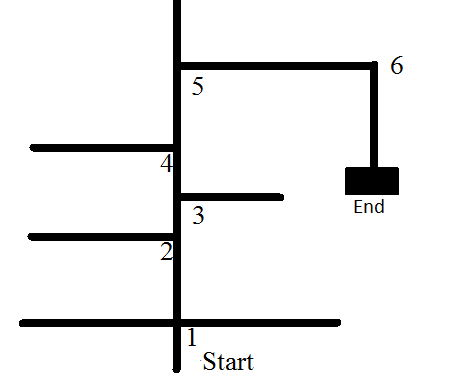

# Demo of Maze Solving Algorithm
https://github.com/BogdanMoale/AI-Enabled-RoboPilot/assets/140835590/af0df2dd-7b14-471a-8c75-45797d15824d

# Introduction

The current project aims to create a robot that can be controlled using various algorithms, starting from certain available models. The robot is powered by two DC motors, and the algorithms are numerically implemented on an Arduino development board with an embedded microcontroller. The possible algorithms to be selected are as follows:

* Algorithm for obstacle detection and avoidance, through which the robot will be capable of navigating autonomously through its surrounding environment.
* Algorithm for tracking a trajectory represented by a black line.
* Algorithm that allows the robot to reach from one point to another.
* Algorithm for solving a maze. This algorithm is an extension of the trajectory tracking algorithm.
* Algorithm for voice control.

To optimize the algorithms i use PID regulator.

A PID (Proportional-Integral-Derivative) regulator is a control system feedback mechanism widely used in engineering, industrial processes, and automation to maintain a desired setpoint or target value for a specific variable. It continuously calculates and adjusts an actuator's output based on the error between the setpoint and the actual value of the controlled variable, ensuring that the system remains stable and accurate.

Here's a breakdown of the three components of the PID regulator:

* Proportional (P) term:
The proportional term is directly proportional to the error between the setpoint and the current value of the controlled variable. It generates an output that is a multiple of the error, which helps to drive the system towards the desired setpoint. A higher proportional gain results in a stronger response to the error, but it can also lead to overshooting or instability if set too high.

* Integral (I) term:
The integral term is responsible for eliminating any steady-state error that may persist due to disturbances or inaccuracies in the system. It integrates the accumulated error over time and adds it to the controller's output. This helps in slowly reducing the remaining error, leading to a more precise control. However, if the integral gain is set too high, it can introduce oscillations or even cause instability.

* Derivative (D) term:
The derivative term anticipates the future trend of the error by calculating its rate of change. It helps to dampen the system's response, reducing overshoot and stabilizing the system quickly. It is particularly useful in systems with fast-changing dynamics or when responding to sudden changes. However, if the derivative gain is set too high, it can amplify high-frequency noise and cause instability.

The PID controller's output is calculated as follows:

Output = Kp * (Error) + Ki * (∫Error dt) + Kd * (dError/dt)

Where:

* Kp, Ki, and Kd are the proportional, integral, and derivative gains, respectively.
* Error is the difference between the setpoint and the current value of the controlled variable.
* ∫Error dt represents the integral term, which is the accumulation of the error over time.
* dError/dt represents the derivative term, which is the rate of change of the error.

Tuning a PID controller involves adjusting the values of Kp, Ki, and Kd to achieve the desired balance between fast response, minimal overshoot, and stability for the specific control system. Proper tuning is essential to ensure optimal performance and prevent potential issues like oscillations or sluggish responses. There are various methods and algorithms available for tuning PID controllers, depending on the application and system dynamics.

# Necessary parts
1. Arduino Uno: https://www.robofun.ro/platforme-de-dezvoltare/arduino-uno-r3.html
2. HC-SR04 Ultrasonic Module Detector: https://www.robofun.ro/senzori/hc-sr04-senzor-distanta-ultrasonic.html
3. Infrared Sensors for Line Tracking(analog version): https://www.robofun.ro/senzori/bara-senzori-linie-analogic-qtr-8a.html
4. Motor Driver: https://www.robofun.ro/mecanice/sparkfun-driver-motor-qwiic.html
5. Bluetooth Module HC-05: https://www.robofun.ro/wireless/modul-bluetooth-hc-05-master-slave-cu-buton.html
6. One servomotor : https://www.robofun.ro/mecanice/servomotor-9g.html
7. Robot Kit which contains: 2 wheels, 2 DC motors, wires, plastic platform battery holder,and all necessary parts to asamble together: https://www.robofun.ro/kit-roboti/kit-sasiu-vehicul-robotic-cu-carcasa-transparenta.html

Please note that the links that i provided is just for information, I don't own the respective platform and I'm not affiliated.

# Connecting parts

## HC-SR04 Ultrasonic Module

## Infrared Sensors for Line Tracking

## Motor Driver

## Bluetooth Module HC-05

## Servomotor

## Final

# Algorithm explanation

## Detecting and Avoiding Obstacles
The operation principle of this algorithm is based on continuously reading the distance using an ultrasonic sensor. A critical distance is established, for example, 15 cm. This critical distance from the obstacle is the distance at which the robot will need to make a decision to avoid that specific obstacle.

As the ultrasonic sensor is mounted on a servo motor, a function is created in the code instructions that rotates the servo motor to the left and right, providing the sensor with the ability to calculate distances both forward and sideways. The servo motor has a rotation angle of 180 degrees, but from experimental determinations, the extreme values of 0 degrees and 180 degrees are not reached. Therefore, it is set that the 80-degree angle is the central angle at which the sensor detects obstacles in the forward direction. The rotation angle for the right direction will be 70 degrees relative to the central angle (80 degrees - 70 degrees = 10 degrees), and for the left direction, it will be 70 degrees relative to the central angle (80 degrees + 70 degrees = 150 degrees).

Each time the robot reaches the critical distance from an obstacle, it will stop and briefly move in the backward direction. This step is necessary to give the robot the ability to turn around without hitting the detected obstacle. The next step is to calculate the lateral distance. The servo motor rotates the sensor to the left and right, and the distances are recorded until the nearest obstacle on the left and right sides is detected. The final step is to compare the lateral distances and make a decision by the robot. If the distance on the left side is greater than that on the right side, then the robot will move in the left direction, and if the distance on the right side is greater than that on the left side, then the robot will move in the right direction

## Reaching the Destination
The algorithm for reaching the destination  allows the robot to reach a certain imposed distance starting from a known initial position, i.e., to go from a known point A (initial position) to a point B (destination).

As previously mentioned, the surrounding environment is always changing and unknown to the robot. For example, in the case of an industrial robot that repeats the same activity day after day, going from point A to point B, it is not necessary for it to adapt to the surrounding environment because it repeats the same path. In such a scenario, having a well-optimized algorithm specific to the activity it performs is sufficient.

However, if the robot needs to change its path, then it must be able to adapt to the surrounding environment. For the algorithm that allows the robot to reach the destination, certain sensors are used to detect the robot's position. Accelerometers or gyroscopes can be used for position detection, but using these sensors significantly increases the robot's cost.

Another simpler method is the use of wheel encoders. With the help of these encoders, the number of revolutions performed by the wheels within a certain time can be counted, allowing an approximate determination of the robot's position relative to the initial position

## Following a Trajectory
In this application, the trajectory will be represented by a black line. In order to follow the line, sensors based on the principle of infrared will be used. The line will be drawn on an open-colored surface because such a surface reflects more, while a dark-colored surface reflects less, allowing the robot to distinguish between the line it needs to follow and the surface on which the line is drawn.

The main goal of the robot using this algorithm is to be able to follow the line without deviating from it. Even with multiple sensors, without a well-optimized closed-loop control algorithm, there is a significant chance that the robot may lose the line.

To achieve an effective control algorithm that keeps the robot on the line, the following steps need to be performed:

a. Read values from the sensors and store them in a vector.
b. Apply a control algorithm using a PID (Proportional-Integral-Derivative) controller based on the values stored in the vector.

Using these two steps, a reference value is established, representing the correct position of the robot on the line. The sensors continuously read the current position on the line, and it is compared to the reference value. The difference between the reference value and the current position on the line is the error. This error needs to be minimized, ideally approaching zero, so the robot can follow the line as accurately as possible.

The robot uses 6 infrared sensors for line tracking. Each sensor displays a value close to 1000 when it perfectly detects the line and much smaller values when it doesn't detect the line.

The algorithm for recording values from the sensors is as follows: The sensors are numbered from 0 to 5 (6 sensors in total). The value from sensor 0 is read, multiplied by the number of the sensor from which it was read (in this case, sensor 0), and the result is then multiplied by the value 1000.

## Maze Solving 

In this application, the maze will be represented by lines drawn in such a way as to form a labyrinth. Therefore, it is crucial that before implementing such an algorithm, the robot already has an algorithm for line following, as the maze-solving algorithm is an extension of the line-following algorithm.

There are several methods for solving a maze, but some of the most well-known ones include the "left-hand rule" and the "right-hand rule" 

The robot may encounter the following intersections where it will have to make a decision : 

* T-shaped intersection, where the robot can choose to go left or right.
* Cross-shaped intersection, where the robot can choose to go forward, left, or right.
* Intersection with a straight path ahead or to the left.
* Intersection with a straight path ahead or to the right.
* Dead end, where the robot needs to turn around.
* The exit of the maze.

The maze-solving algorithm will use the information from the line-following algorithm to navigate through the maze and make decisions at intersections based on specific rules. It needs to explore the maze while avoiding obstacles and find the path that leads to the exit.

Implementing a maze-solving algorithm can be a challenging but exciting task for the robot, as it requires intelligent decision-making and navigation capabilities to find the correct path to the maze's exit.

Applying the left-hand rule, at each intersection, the robot will have only one option, which is to always turn left. Therefore, at a T-shaped intersection, the robot will choose to turn left. At a cross-shaped intersection, it will choose to turn left. At an intersection with a straight path ahead or to the left, the chosen direction will be left. At an intersection with a straight path ahead or to the right, the chosen direction will be straight ahead. When the robot finds the exit of the maze, it needs to stop.

The algorithm is composed of two parts. In the first part, the robot will navigate through the entire maze, even if it takes wrong turns. While navigating through the maze, the robot will store each decision it makes in a vector. The characters "S" (for left), "D" (for right), "U" (for a dead end), and "I" (for straight ahead) will be stored in the vector.

In the second part of the algorithm, when the robot has already found the exit, it needs to take the shortest path back to the entrance, avoiding the wrong turns.

By following the left-hand rule, the robot is guaranteed to eventually find the exit of the maze if there is a continuous path leading to it. The stored decisions in the vector will help the robot retrace its path back to the entrance and avoid going down the wrong path.

The memory allocated to the vector should be directly proportional to the number of intersections in the maze. As the maze size increases, the memory allocated to the vector should also increase.

When the robot encounters a dead end, it needs to turn around, indicating that it has taken a wrong path. The next time it navigates through the maze, it must avoid any dead ends. To achieve this, a function is created to optimize the vector that stores the robot's decisions.

Since a dead end already represents a wrong path, the optimization function for the vector that stores the robot's decisions should be applied whenever there is a sequence of 3 characters in the vector, and one of these characters is "U" (representing a dead end).

The optimization function will identify such sequences and remove the middle "U" character, effectively correcting the previous wrong decision. By removing the "U" character, the robot will be guided to avoid going down the same wrong path in the future.

The optimization process ensures that the robot improves its path-finding capabilities and increases the likelihood of finding the correct path to the maze's exit.

### Exemple

The robot starts from the starting position. At the first intersection, the robot turns left, and the character "S" is stored in the vector.

Next, the robot encounters a dead end, and the character "U" is stored in the vector. The robot returns to the first intersection and, following the left-hand rule, turns left again. The character "S" is stored in the vector.

At the second intersection, the robot turns left, encounters another dead end, and returns to the second intersection, where it turns left again. Thus, the characters "S U S" are stored in the vector.

At the third intersection, the robot goes straight ahead, and the character "I" is stored in the vector.

At the fourth intersection, the situation is identical to the second intersection, so the characters "S U S" are stored in the vector.

The vector now contains the recorded decisions as the robot navigates through the maze, and it indicates the path it took, including the wrong turns (represented by "U") and the correct turns (represented by "S" and "I").

The optimization function will identify the sequence "S U S" and remove the "U" character, effectively correcting the previous wrong decision. The optimized vector will then guide the robot to follow a more efficient path to the maze's exit.

At the fifth intersection, the robot goes straight ahead, and the character "I" is stored in the vector. Next, it encounters another dead end, and the character "U" is stored in the vector. The robot then returns to the fifth intersection, turns left following the left-hand rule, and the character "S" is stored in the vector.

At the sixth intersection, the only option available for the robot is to turn right, and the character "D" is stored in the vector.

The vector now contains the recorded decisions as the robot continues to navigate through the maze, including the path it took, the wrong turns (represented by "U"), the correct turns to the left (represented by "S"), and the correct turn to the right (represented by "D").

As the robot continues exploring the maze and encountering dead ends or revisiting intersections, the vector will be updated to reflect its path. The optimization function will periodically check for sequences like "S U S" and remove the "U" character, optimizing the vector to guide the robot to the maze's exit more efficiently.

The vector of all decisions the robot has taken while navigating through the maze is: Upath = [SUSSUSISUSIUSD]

After applying the path optimization function, the vector becomes: Upathoptimization = [IIIIDD]

The algorithm described works well in a maze that has an exit represented by three horizontal lines. However, if the maze does not have an exit, the robot will continue moving through the maze and memorizing each decision it takes.

Without a definite exit, the memory allocated to the vector for storing decisions will eventually fill up as the robot keeps making new decisions without finding a way out. As a result, the robot's behavior may become imprecise and inefficient.

For a more robust maze-solving algorithm, it is essential to ensure that the maze has a clearly defined exit. Additionally, you may implement mechanisms to handle situations where the robot has explored the entire maze without finding an exit, allowing it to make decisions that can lead it back to previously unexplored areas or backtrack to optimize its path. This way, the robot can navigate more efficiently even in mazes without a predefined exit.

